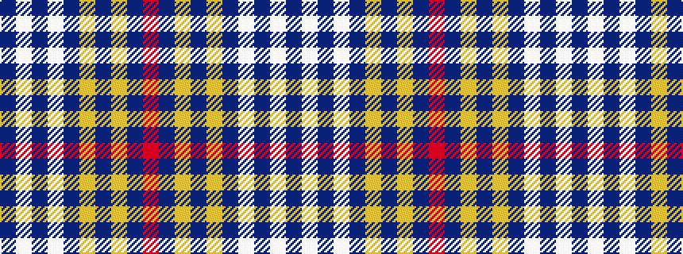

BWBWBYBYBR

It is a 10 stripe tartan.

<figure class="pat-woven">

<figcaption>idealised sample</figcaption>
</figure>

## Colour Sequence



## Tartans with this colour sequence

| Tartans |
|---------------|
| [Dundee F.C.](/variants/s10/db6w4db3w6db8ly3db52ly3db8r4/)|
||
| [Dundee F.C. Corporate Tartan](/variants/s10/db6w4db3w6db8lo3db52lo3db8r4/)|
||
| [Dundee Football Club](/variants/s10/dt3lb2dt2lb3dt6ly2dt26ly2dt6r2~x2/)|
||
