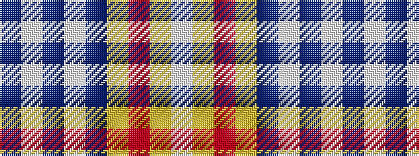

BWBWBYRYW

It is a 9 stripe tartan.

<figure class="pat-woven">

<figcaption>idealised sample</figcaption>
</figure>

## Colour Sequence



## Tartans with this colour sequence

| Tartans |
|---------------|
| [George, Stuart (Personal)](/setts/s9/db62w2db4w5db6lo2r8lo3w4~x2/)|
||
| [George, Stuart (Personal)](/setts/s9/db62w2db4w5db6ly2r8ly3w4~x2/)|
||
