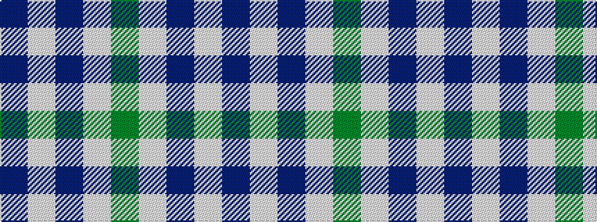

BWBWG

It is a 5 stripe tartan.

<figure class="pat-woven">

<figcaption>idealised sample</figcaption>
</figure>

## Colour Sequence



## Tartans with this colour sequence

| Tartans |
|---------------|
| [Martin Family, Robert N (Personal)](/variants/s5/dr27w3dr6w2g3~x4/)|
||
