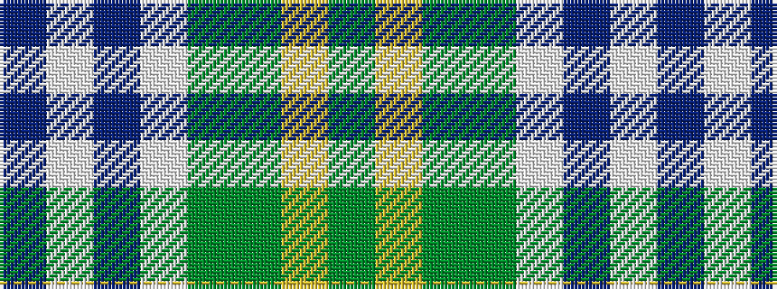

BWBWGGYG

It is a 8 stripe tartan.

<figure class="pat-woven">

<figcaption>idealised sample</figcaption>
</figure>

## Colour Sequence



## Tartans with this colour sequence

| Tartans |
|---------------|
| [Gigha, Green (Dance)](/setts/s8/db4w2db1w18dg18g18ly3g4~x2/)|
||
