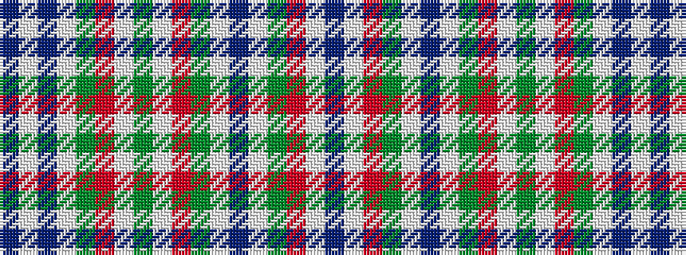

BWBWGRWGWRGWBWGRWB

It is a 18 stripe tartan.

<figure class="pat-woven">

<figcaption>idealised sample</figcaption>
</figure>

## Colour Sequence



## Tartans with this colour sequence

| Tartans |
|---------------|
| [Miyuki, House Check Grey, 1003A](/variants/s18/n12lb14r3y6lb10n28lb10y6r3lb8y10lb8r3y6lb40n6lb6n6/)|
||
