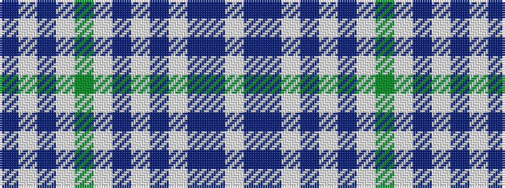

BWBWGWBWBWBBW

It is a 13 stripe tartan.

<figure class="pat-woven">

<figcaption>idealised sample</figcaption>
</figure>

## Colour Sequence



## Tartans with this colour sequence

| Tartans |
|---------------|
| [McGillivray, Pauline (Personal)](/variants/s13/w6t1db1w57t2w2db23w4g30w6t1w6db2~x2/)|
||
