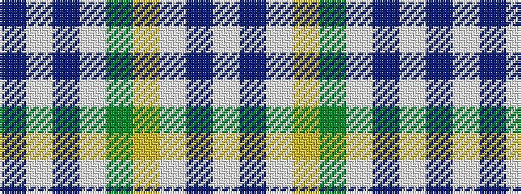

BWBWGYWBW

It is a 9 stripe tartan.

<figure class="pat-woven">

<figcaption>idealised sample</figcaption>
</figure>

## Colour Sequence



## Tartans with this colour sequence

| Tartans |
|---------------|
| [Milne dress green](/variants/s9/w14t3w14ly1g20w15t3w7dp3~x2/)|
||
