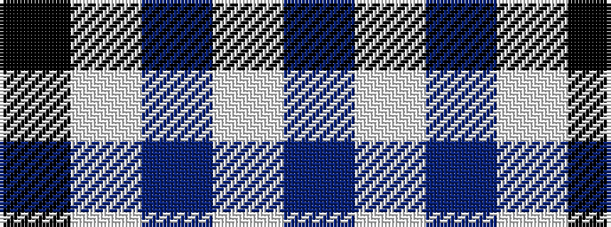

BWBWK

It is a 5 stripe tartan.

<figure class="pat-woven">

<figcaption>idealised sample</figcaption>
</figure>

## Colour Sequence



## Tartans with this colour sequence

| Tartans |
|---------------|
| [Debbie Munro Memorial (Corporate)](/setts/s5/db26lp11db3lp4k2~x4/)|
||
