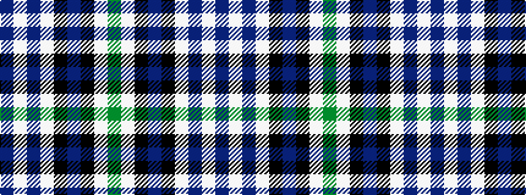

BWBWKBKWG

It is a 9 stripe tartan.

<figure class="pat-woven">

<figcaption>idealised sample</figcaption>
</figure>

## Colour Sequence



## Tartans with this colour sequence

| Tartans |
|---------------|
| [Queen Margaret University](/variants/s9/db4w3db17lb10k1dp5k1lb6dg3~x2/)|
||
