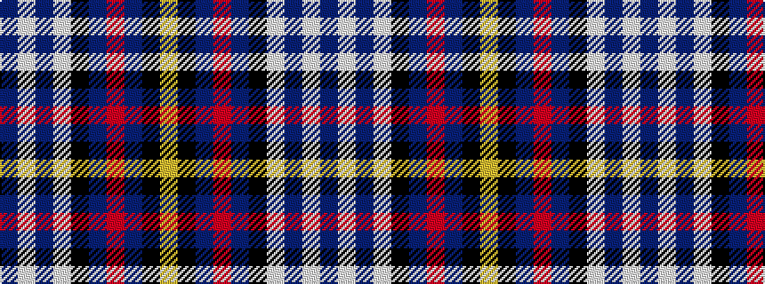

BWBWKBRBKY

It is a 10 stripe tartan.

<figure class="pat-woven">

<figcaption>idealised sample</figcaption>
</figure>

## Colour Sequence



## Tartans with this colour sequence

| Tartans |
|---------------|
| [Gillies Dress Blue](/variants/s10/lo12k3b24r12b24k32w44b4w8b4/)|
||
| [Gillies, dress Blue](/variants/s10/ly6k2t15r5t9k13w25db2w3db2~x2/)|
||
