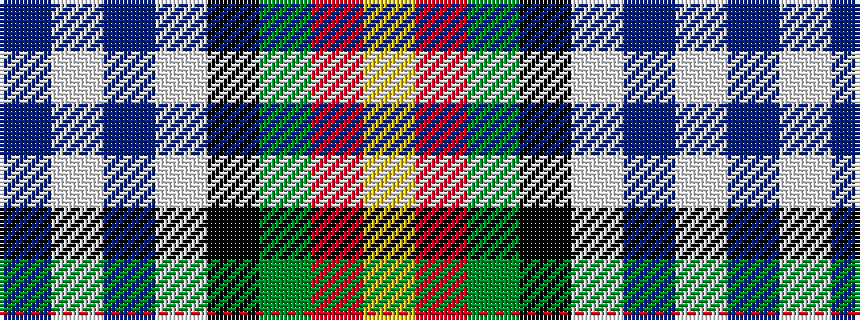

BWBWKGRY

It is a 8 stripe tartan.

<figure class="pat-woven">

<figcaption>idealised sample</figcaption>
</figure>

## Colour Sequence



## Tartans with this colour sequence

| Tartans |
|---------------|
| [Edinburgh Napier University (Corp.)](/variants/s8/t4w4t4w5k8g2r19lo1~x2/)|
||
