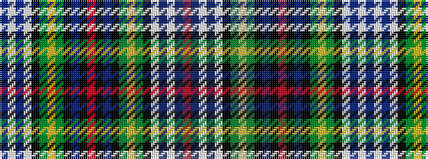

BWBWKGYGKBKRKBKGYGKWBWBR

It is a 24 stripe tartan.

<figure class="pat-woven">

<figcaption>idealised sample</figcaption>
</figure>

## Colour Sequence



## Tartans with this colour sequence

| Tartans |
|---------------|
| [Kilbarchan Unidentified No. 2](/variants/s24/r3k1t14k13g14ly3g14k14w4t4w23t1r3~x2/)|
||
