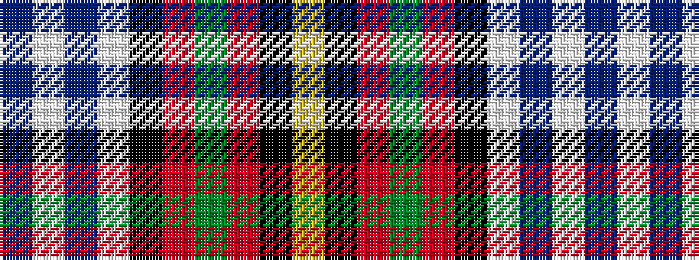

BWBWKRGRKY

It is a 10 stripe tartan.

<figure class="pat-woven">

<figcaption>idealised sample</figcaption>
</figure>

## Colour Sequence



## Tartans with this colour sequence

| Tartans |
|---------------|
| [Gillies Red Dress](/setts/s10/ly6k2r12dg4r8k10w24t2w3t2~x2/)|
||
| [Gillies, dress Red](/setts/s10/ly6k2r15g5r8k12w24t2w4t2~x2/)|
||
