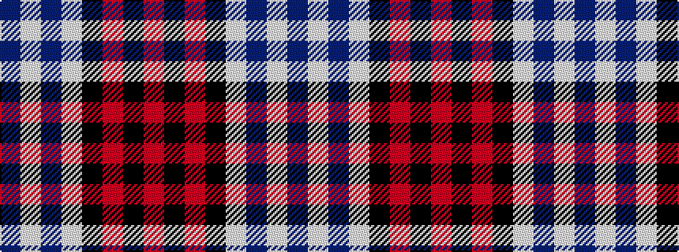

BWBWKRKR

It is a 8 stripe tartan.

<figure class="pat-woven">

<figcaption>idealised sample</figcaption>
</figure>

## Colour Sequence



## Tartans with this colour sequence

| Tartans |
|---------------|
| [Unidentified (ex Tony Murray)](/variants/s8/dt8w22dt5w4k24r6k2r6~x2/)|
||
