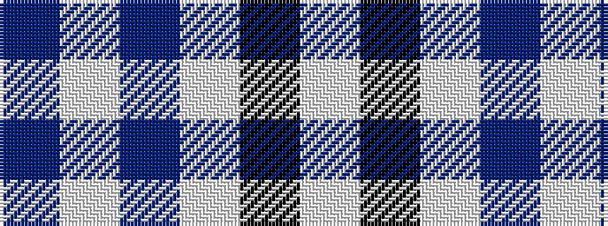

BWBWKW

It is a 6 stripe tartan.

<figure class="pat-woven">

<figcaption>idealised sample</figcaption>
</figure>

## Colour Sequence



## Tartans with this colour sequence

| Tartans |
|---------------|
| [Ailsa, Navy (Dance)](/setts/s6/db8w3db28w32k3w4~x2/)|
||
