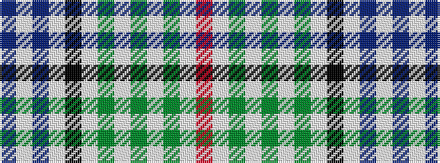

BWBWKWGWGWGWR

It is a 13 stripe tartan.

<figure class="pat-woven">

<figcaption>idealised sample</figcaption>
</figure>

## Colour Sequence



## Tartans with this colour sequence

| Tartans |
|---------------|
| [Robert Wiseman Dairies, Golden Jubilee](/setts/s13/b5w2b2w4k27w2g2w2g6w2g2w22m2~x2/)|
||
| [Wiseman, Robert (Corporate)](/setts/s13/t5w2t2w4k27w2g2w2g6w2g2w22r2~x2/)|
||
