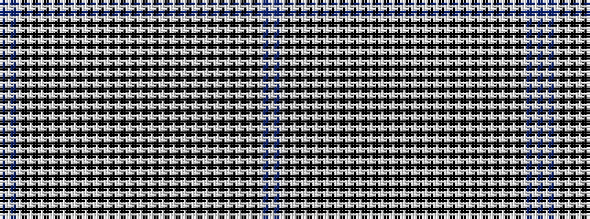

BWBWKWKWKWKWKWKWKWKWKWKWKWKWKWKWKWKWKWKWKWKWKWKWBW

It is a 50 stripe tartan.

<figure class="pat-woven">

<figcaption>idealised sample</figcaption>
</figure>

## Colour Sequence



## Tartans with this colour sequence

| Tartans |
|---------------|
| [Kilbarchan Unidentified No. 5](/setts/s50/db10w4db60w1k1w1k1w1k1w1k1w1k1w1k1w2k2w2k2w36k10w2k10w2k10w2~x2/)|
||
