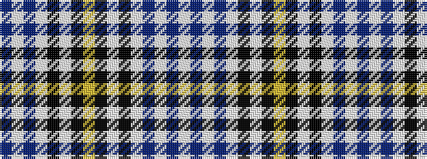

BWBWKWKYKWKWBWBW

It is a 16 stripe tartan.

<figure class="pat-woven">

<figcaption>idealised sample</figcaption>
</figure>

## Colour Sequence



## Tartans with this colour sequence

| Tartans |
|---------------|
| [Henderson Dress (Dance)](/setts/s16/b3w3b1w5k1w2k3lo1k3w2k1w5b1w3b3w1~x4/)|
||
