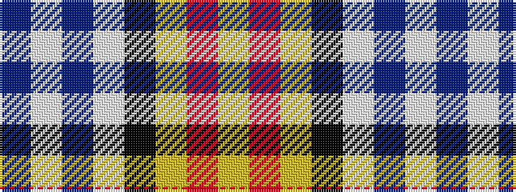

BWBWKYRY

It is a 8 stripe tartan.

<figure class="pat-woven">

<figcaption>idealised sample</figcaption>
</figure>

## Colour Sequence



## Tartans with this colour sequence

| Tartans |
|---------------|
| [Edinburgh Napier University](/setts/s8/db4w8db8w10k16lg4r38ly1/)|
||
