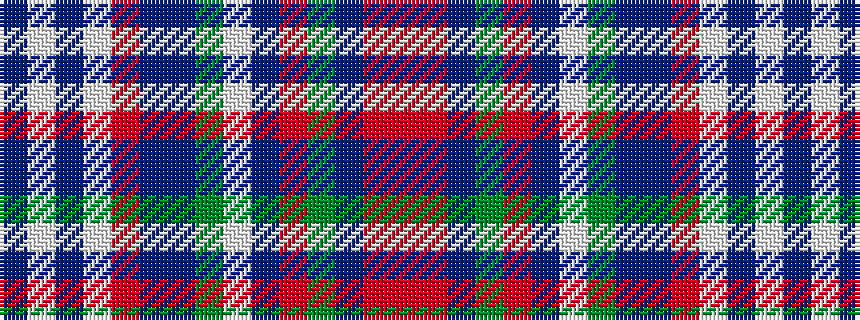

BWBWRBBGWBRGBRR

It is a 15 stripe tartan.

<figure class="pat-woven">

<figcaption>idealised sample</figcaption>
</figure>

## Colour Sequence



## Tartans with this colour sequence

| Tartans |
|---------------|
| [Highlands of Haliburton Dress](/variants/s15/t4w2t1w19r2dr4t8g4w2t3o2g2dr2r2o2~x2/)|
||
