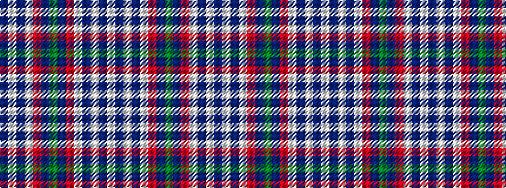

BWBWRBGBRWBWBW

It is a 14 stripe tartan.

<figure class="pat-woven">

<figcaption>idealised sample</figcaption>
</figure>

## Colour Sequence



## Tartans with this colour sequence

| Tartans |
|---------------|
| [Culloden Red Dress (Dance)](/variants/s14/g16dp8r45w6dp45w44dp6w12/)|
||
