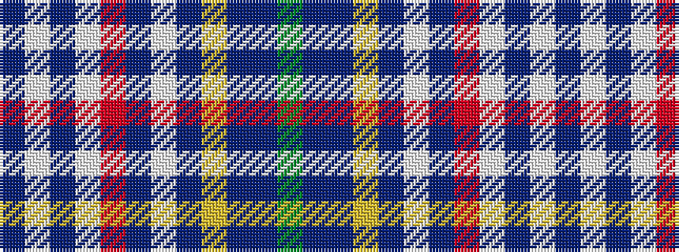

BWBWRBWBYBBG

It is a 12 stripe tartan.

<figure class="pat-woven">

<figcaption>idealised sample</figcaption>
</figure>

## Colour Sequence



## Tartans with this colour sequence

| Tartans |
|---------------|
| [MacLean of Duart 7](/variants/s12/y12t2dr4ly2dr3w3dr3o20w29t2w4dr2~x2/)|
||
