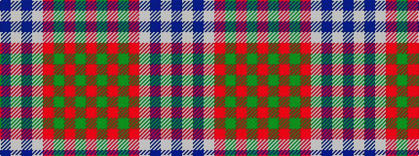

BWBWRGRGR

It is a 9 stripe tartan.

<figure class="pat-woven">

<figcaption>idealised sample</figcaption>
</figure>

## Colour Sequence



## Tartans with this colour sequence

| Tartans |
|---------------|
| [Prince of Denmark (Corporate)](/variants/s9/r52dg2r2dg2r3w3db2w2db2~x4/)|
||
