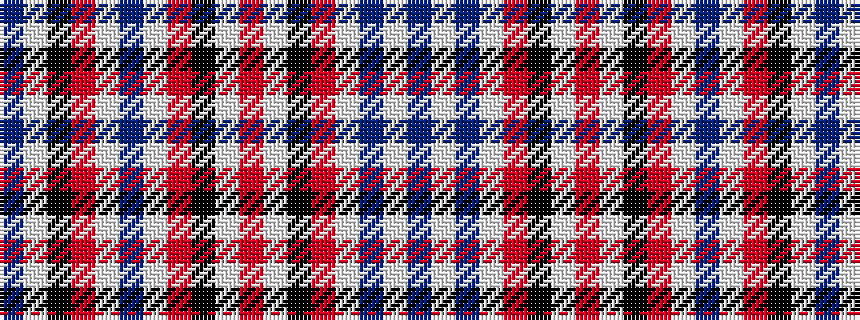

BWBWRKWRWKRWBWRKWB

It is a 18 stripe tartan.

<figure class="pat-woven">

<figcaption>idealised sample</figcaption>
</figure>

## Colour Sequence



## Tartans with this colour sequence

| Tartans |
|---------------|
| [Miyuki #3 (Fashion)](/variants/s18/n12lb14k3r6lb10n28lb10r6k3lb8r10lb8k3r6lb40n6lb6n6/)|
||
