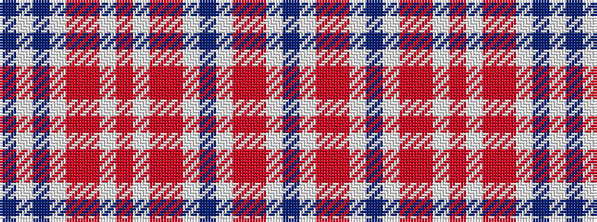

BWBWRRWRWRRWBWRRWB

It is a 18 stripe tartan.

<figure class="pat-woven">

<figcaption>idealised sample</figcaption>
</figure>

## Colour Sequence



## Tartans with this colour sequence

| Tartans |
|---------------|
| [Miyuki #3](/setts/s18/n12lb14r3o6lb10n28lb10o6r3lb8o10lb8r3o6lb40n6lb6n6/)|
||
