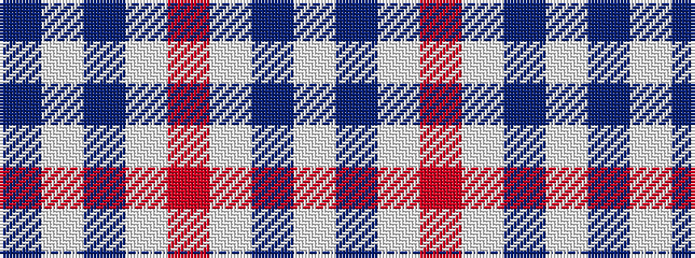

BWBWRWBW

It is a 8 stripe tartan.

<figure class="pat-woven">

<figcaption>idealised sample</figcaption>
</figure>

## Colour Sequence



## Tartans with this colour sequence

| Tartans |
|---------------|
| [Milne Dress Family Tartan](/variants/s8/w18db4w18r30w18db4w9dp4/)|
||
| [Milne, Dress (Dance)](/variants/s8/w12t2w12r17w12t2w5dp2~x4/)|
||
| [Milne, dress](/variants/s8/w18db4w18r30w18db4w9p4/)|
||
