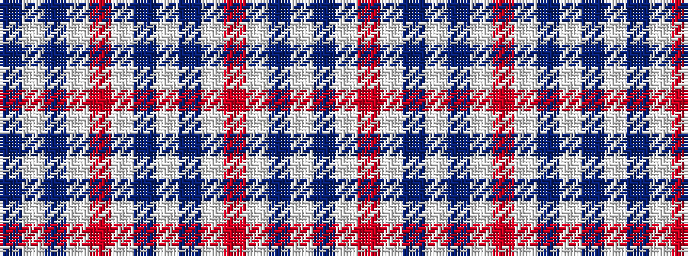

BWBWRWBWBWRWBW

It is a 14 stripe tartan.

<figure class="pat-woven">

<figcaption>idealised sample</figcaption>
</figure>

## Colour Sequence



## Tartans with this colour sequence

| Tartans |
|---------------|
| [Milne Dress Fancy Tartan](/variants/s14/w5t2w12r17w12t2w12t2w12r17w12t2w5dp2~x4/)|
||
