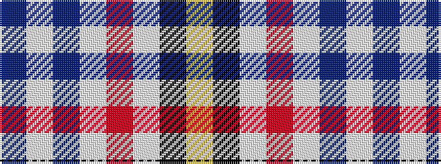

BWBWRWKY

It is a 8 stripe tartan.

<figure class="pat-woven">

<figcaption>idealised sample</figcaption>
</figure>

## Colour Sequence



## Tartans with this colour sequence

| Tartans |
|---------------|
| [Kile (Red line) (Personal)](/variants/s8/db18w3db3w3r3w3k5ly12~x2/)|
||
