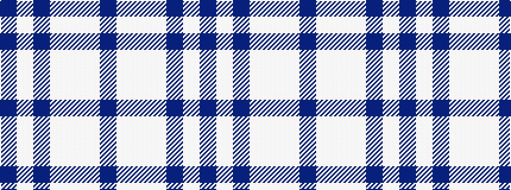

BWBWWWB

It is a 7 stripe tartan.

<figure class="pat-woven">

<figcaption>idealised sample</figcaption>
</figure>

## Colour Sequence



## Tartans with this colour sequence

| Tartans |
|---------------|
| [Langdons (Corporate)](/variants/s7/t2lb4w1lb4t6lb2t2~x4/)|
||
