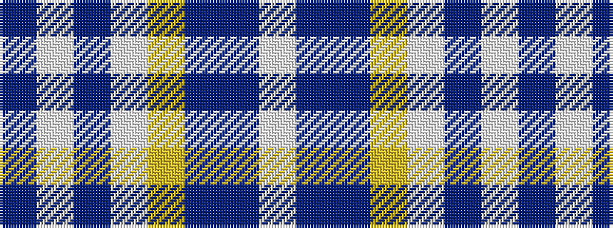

BWBWYBBW

It is a 8 stripe tartan.

<figure class="pat-woven">

<figcaption>idealised sample</figcaption>
</figure>

## Colour Sequence



## Tartans with this colour sequence

| Tartans |
|---------------|
| [Ancient Gathering](/variants/s8/db1lb12p6w1ly3db14b18w1~x2/)|
||
