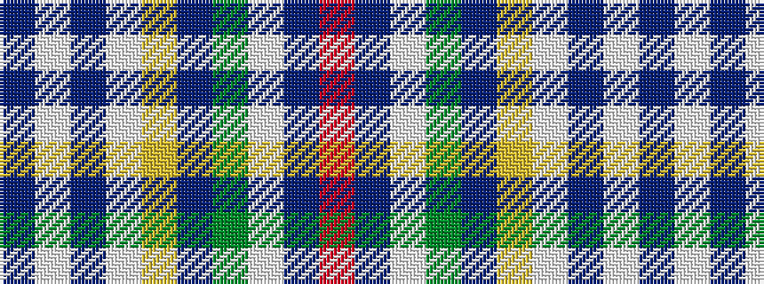

BWBWYBGWBR

It is a 10 stripe tartan.

<figure class="pat-woven">

<figcaption>idealised sample</figcaption>
</figure>

## Colour Sequence



## Tartans with this colour sequence

| Tartans |
|---------------|
| [Stratford (Ontario), City of](/setts/s10/db42w5db1w1ly9db1g2w1db1r1~x4/)|
||
| [Stratford, (Oregon) City of (Dist.)](/setts/s10/b42w5b1w1lo9b1g2w1b1r1~x4/)|
||
