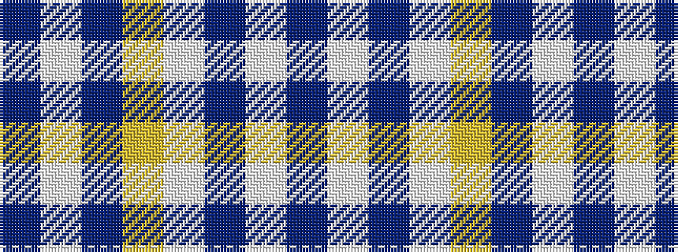

BWBWYBWB

It is a 8 stripe tartan.

<figure class="pat-woven">

<figcaption>idealised sample</figcaption>
</figure>

## Colour Sequence



## Tartans with this colour sequence

| Tartans |
|---------------|
| [Madras 1 (Fashion)](/setts/s8/t45w4db4w2ly14db2w2db2~x4/)|
||
