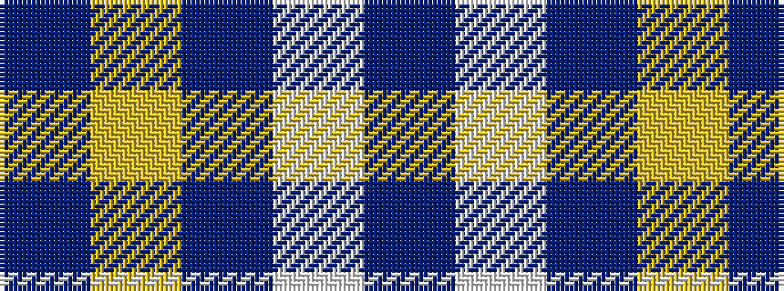

BWBYB

It is a 5 stripe tartan.

<figure class="pat-woven">

<figcaption>idealised sample</figcaption>
</figure>

## Colour Sequence



## Tartans with this colour sequence

| Tartans |
|---------------|
| [Greenock Morton F. C. (Corporate)](/variants/s5/db19w6db105ly4db5/)|
||
