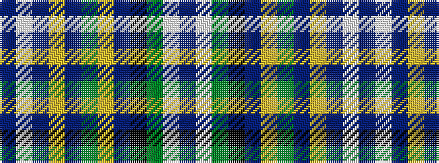

BWBYBGYBKGWB

It is a 12 stripe tartan.

<figure class="pat-woven">

<figcaption>idealised sample</figcaption>
</figure>

## Colour Sequence



## Tartans with this colour sequence

| Tartans |
|---------------|
| [Fife (Mann)](/setts/s12/b2w1b12lo3b7dy2lo1b2k1g4w1b2~x4/)|
||
