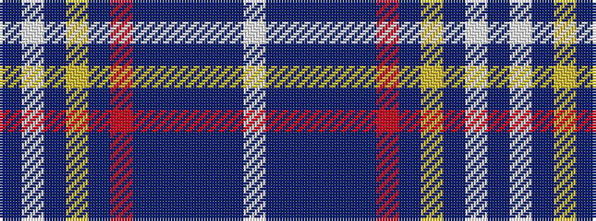

BWBYBRBBBBBW

It is a 12 stripe tartan.

<figure class="pat-woven">

<figcaption>idealised sample</figcaption>
</figure>

## Colour Sequence



## Tartans with this colour sequence

| Tartans |
|---------------|
| [Mead of Poetry (Fashion)](/variants/s12/w6n2db6n2db25n2r1n2ly3t5w6n4~x2/)|
||
| [Mead of Poetry, The](/variants/s12/w6n2db6n2db25n2r1n2ly3dbi5w6n4~x2/)|
||
