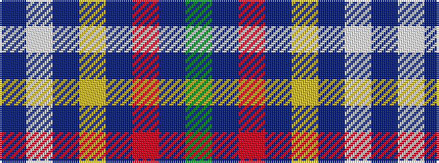

BWBYBRBG

It is a 8 stripe tartan.

<figure class="pat-woven">

<figcaption>idealised sample</figcaption>
</figure>

## Colour Sequence



## Tartans with this colour sequence

| Tartans |
|---------------|
| [Royal Agricultural Winter Fair](/setts/s8/db32lb1db1lo2db1r1db4dg16~x4/)|
||
