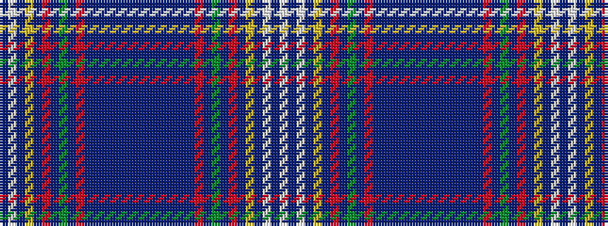

BWBYBRBGBRBBBBBBBBBBBBBRBGBRBYBWBW

It is a 34 stripe tartan.

<figure class="pat-woven">

<figcaption>idealised sample</figcaption>
</figure>

## Colour Sequence



## Tartans with this colour sequence

| Tartans |
|---------------|
| [New York Tartan Day Parade (Corp.)](/variants/s34/db2w1db28lo1db4r4db1g2db1r8db1n2db1n2db1n2db1n2db1n2db1n2db1r8db1g2db1r4db4lo1db56w1db2w2~x2/)|
||
