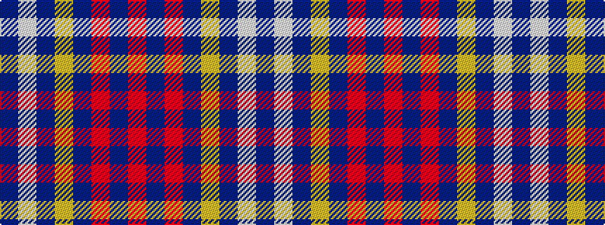

BWBYBRBR

It is a 8 stripe tartan.

<figure class="pat-woven">

<figcaption>idealised sample</figcaption>
</figure>

## Colour Sequence



## Tartans with this colour sequence

| Tartans |
|---------------|
| [Heriot](/variants/s8/o20db2o2db2lo3db12w18db3~x2/)|
||
