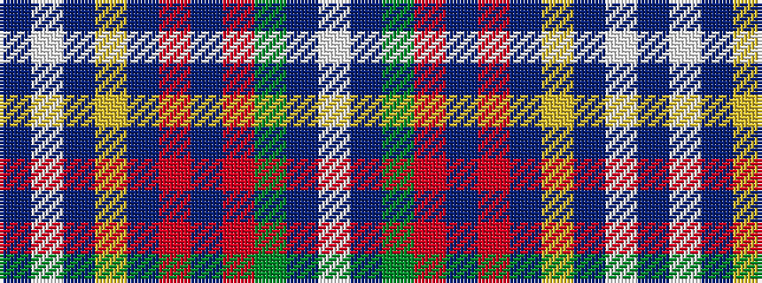

BWBYBRBRGBW

It is a 11 stripe tartan.

<figure class="pat-woven">

<figcaption>idealised sample</figcaption>
</figure>

## Colour Sequence



## Tartans with this colour sequence

| Tartans |
|---------------|
| [Sons of Scotland (Corporate)](/setts/s11/db2w2db21lo3db4r3db3m4g18b4w2~x2/)|
||
