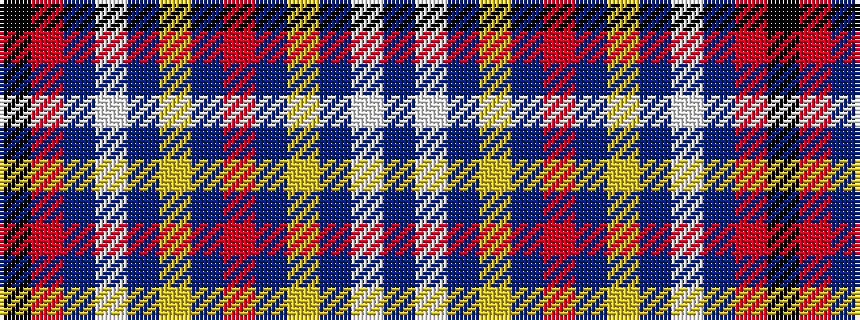

BWBYBRBYBWBRK

It is a 13 stripe tartan.

<figure class="pat-woven">

<figcaption>idealised sample</figcaption>
</figure>

## Colour Sequence



## Tartans with this colour sequence

| Tartans |
|---------------|
| [Royal National Lifeboat Inst. (Corp)](/variants/s13/db15w2db15ly2db15r2db15ly2db15w2db15r4k2~x2/)|
||
