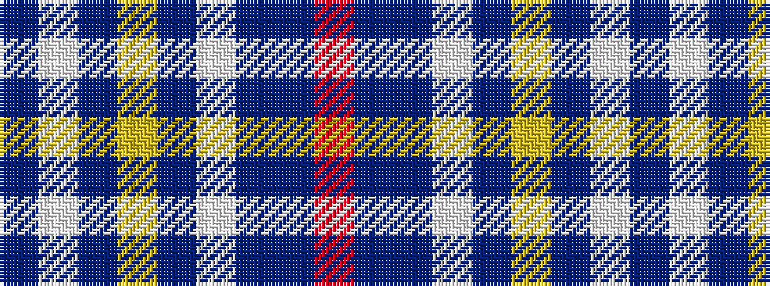

BWBYBWBBR

It is a 9 stripe tartan.

<figure class="pat-woven">

<figcaption>idealised sample</figcaption>
</figure>

## Colour Sequence



## Tartans with this colour sequence

| Tartans |
|---------------|
| [Musselburgh](/variants/s9/t14lb1t3lo2t3lb1t4db24r3~x4/)|
||
| [Musselburgh](/variants/s9/t14w1t3ly2t3w1t4db24r3~x2/)|
||
