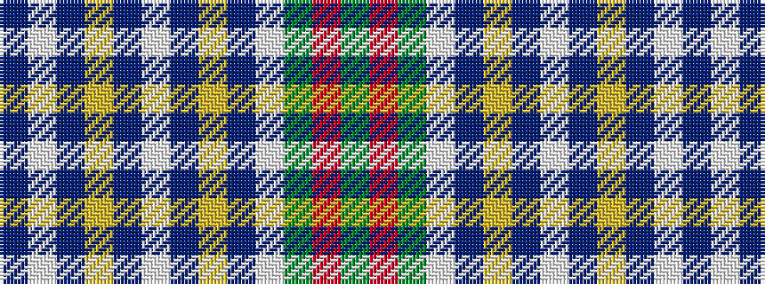

BWBYBWBYBWGRG

It is a 13 stripe tartan.

<figure class="pat-woven">

<figcaption>idealised sample</figcaption>
</figure>

## Colour Sequence



## Tartans with this colour sequence

| Tartans |
|---------------|
| [Holiday Inn Crown Plaza](/setts/s13/g27r2g3w3db3ly2db14w2db3ly3db3w2db14~x2/)|
||
