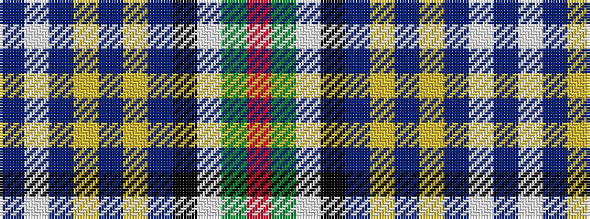

BWBYBYBKWGR

It is a 11 stripe tartan.

<figure class="pat-woven">

<figcaption>idealised sample</figcaption>
</figure>

## Colour Sequence



## Tartans with this colour sequence

| Tartans |
|---------------|
| [Quigley of Knockcroghery Htg (Per.)](/setts/s11/b27w2b15ly1b1ly1b15k2w2y16r1~x2/)|
||
