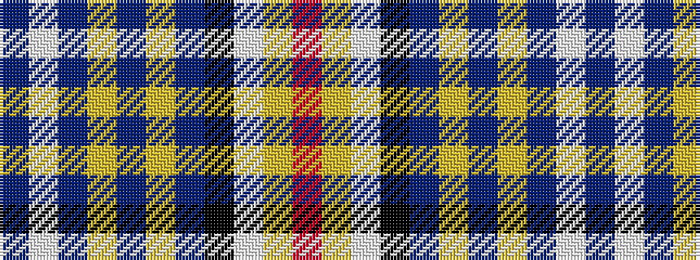

BWBYBYBKWYR

It is a 11 stripe tartan.

<figure class="pat-woven">

<figcaption>idealised sample</figcaption>
</figure>

## Colour Sequence



## Tartans with this colour sequence

| Tartans |
|---------------|
| [Quigley of Knockcroghery (Hunting) (Personal)](/setts/s11/t27w2t15ly1t1ly1t15k2w2ly16r1~x2/)|
||
