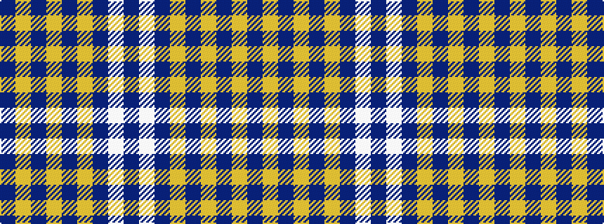

BWBYBYBYB

It is a 9 stripe tartan.

<figure class="pat-woven">

<figcaption>idealised sample</figcaption>
</figure>

## Colour Sequence



## Tartans with this colour sequence

| Tartans |
|---------------|
| [University of Delaware (Corporate)](/variants/s9/db43ly5db1ly4db1ly2db7w1db2~x2/)|
||
| [University of Delaware Fightin' Blue Hen](/variants/s9/b43ly5b1ly4b1ly2b7w1b2~x2/)|
||
