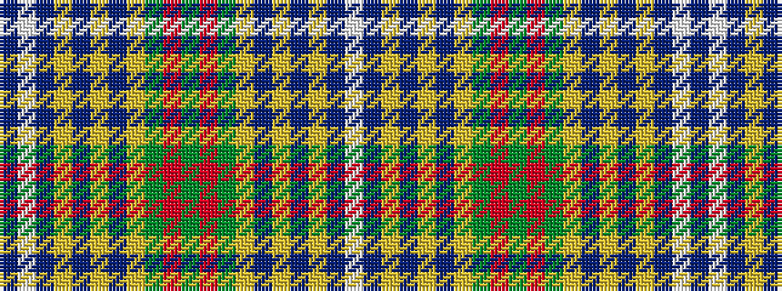

BWBYBYBYGRGRGYBYBYBW

It is a 20 stripe tartan.

<figure class="pat-woven">

<figcaption>idealised sample</figcaption>
</figure>

## Colour Sequence



## Tartans with this colour sequence

| Tartans |
|---------------|
| [Knox #2](/variants/s20/dg4r1dg1ly1db6ly1dbi9ly1dbi9w1t3~x4/)|
||
