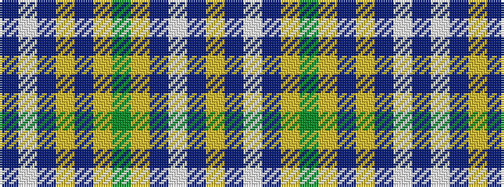

BWBYBYGYBWBY

It is a 12 stripe tartan.

<figure class="pat-woven">

<figcaption>idealised sample</figcaption>
</figure>

## Colour Sequence



## Tartans with this colour sequence

| Tartans |
|---------------|
| [Herry (2016)](/setts/s12/dt50w4dt8ly1dt8ly8g1ly8dt8w1dt8ly4~x2/)|
||
