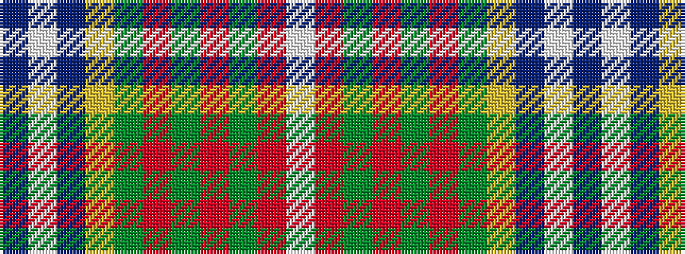

BWBYGRGRGRW

It is a 11 stripe tartan.

<figure class="pat-woven">

<figcaption>idealised sample</figcaption>
</figure>

## Colour Sequence



## Tartans with this colour sequence

| Tartans |
|---------------|
| [Currie of Arran (Clan/family)](/variants/s11/b16w3b2ly4g24r2g4r5g4r2lb8~x2/)|
||
