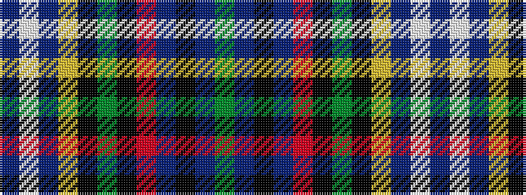

BWBYKGKRBKBG

It is a 12 stripe tartan.

<figure class="pat-woven">

<figcaption>idealised sample</figcaption>
</figure>

## Colour Sequence



## Tartans with this colour sequence

| Tartans |
|---------------|
| [Me to You](/variants/s12/db32w3db3ly3k3g3k3r10db6k3db3g3~x2/)|
||
