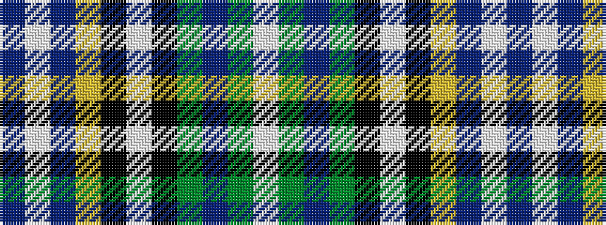

BWBYKWKGBGW

It is a 11 stripe tartan.

<figure class="pat-woven">

<figcaption>idealised sample</figcaption>
</figure>

## Colour Sequence



## Tartans with this colour sequence

| Tartans |
|---------------|
| [O'Shaughnessy (Estimated threadcount)](/setts/s11/db60w3dp8ly2k2w2k2g14db4dy10w2~x2/)|
||
